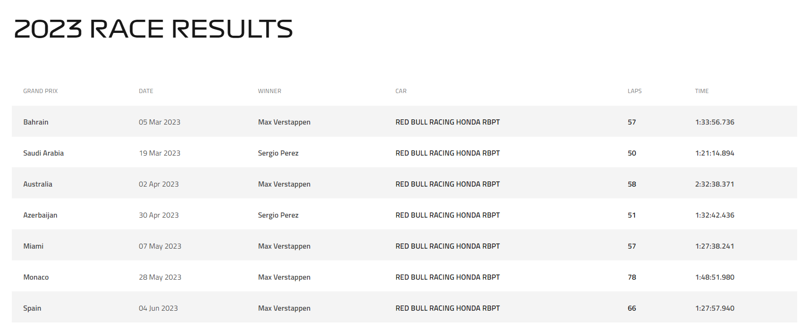
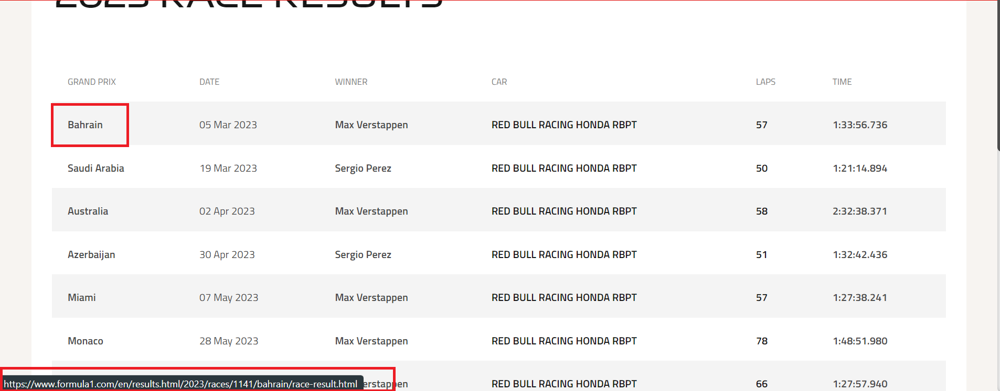
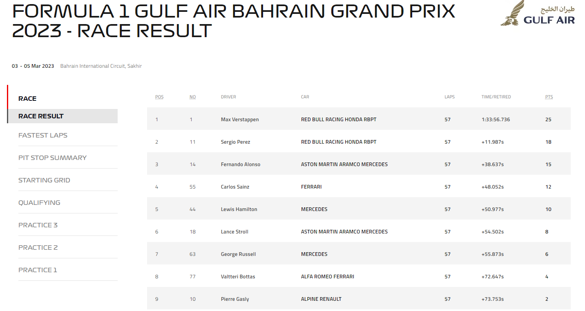
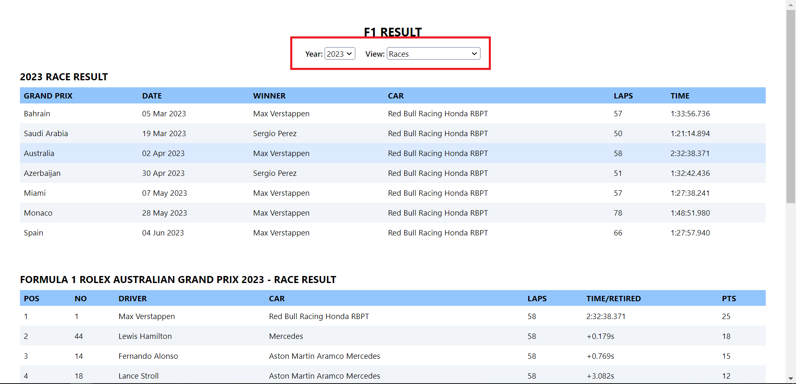
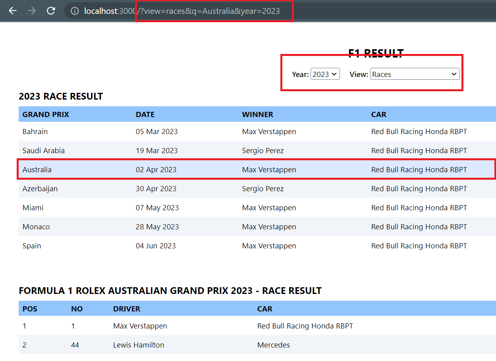
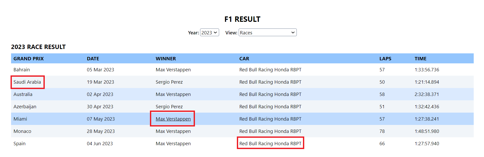
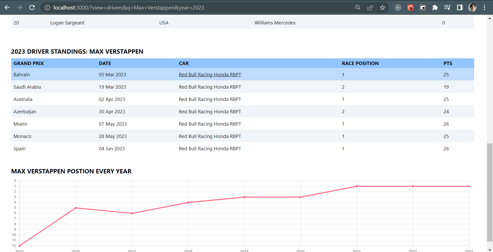

#Quá trình thực hiện và cách triển khai

## I. Quá trình thực hiện

### 1. Cào dữ liệu

- Đầu tiên sử dụng thư viện [**cheerio**](https://cheerio.js.org/) lấy tất cả các năm từ https://www.formula1.com/en/results.html bỏ vào 1 mảng `years`.

- Lấy dữ liệu **races** bằng cách lặp qua mảng `years` và cào dữ liệu từ url https://www.formula1.com/en/results/jcr:content/resultsarchive.html/{year}/races.html với `{year}` chính là từng năm trong mảng `years`. Sử dụng `Promise.all()` để tối ưu tốc độ.

  - Lấy kết quả tổng quan bằng chính kết quả trả về trong url bên trên.
    

  - Lấy kết quả chi tiết từng chặng grand prix bằng url gắn trong tên từng chặng.
    
    

- Làm tương tự để lấy dữ liệu **drivers** từ url https://www.formula1.com/en/results.html/{year}/drivers.html, **teams** từ url https://www.formula1.com/en/results.html/{year}/team.html, **dhl fastest lap award** từ url https://www.formula1.com/en/results.html/{year}/fastest-laps.html

- Sau khi lấy được tất cả dữ liệu thì lưu vào file json.

**Demo dữ liệu lấy được trong `src/assets/demo.json`. Code cào dữ liệu tại https://github.com/hoangloc1307/crawling.**

### 2. Xây dựng UI

- Sử dụng `vite`, `react`, `typescript`, `tailwindcss`, `chartjs` để xây dựng UI.

- User sẽ chọn năm (year) và chế độ xem (view) để xem những thông tin muốn xem.
  

- Sử dụng query string quản lý year và view để có thể share đúng thông tin mình đang xem cho người khác.
  

- Có thể click vào bất kỳ tên của chặng đua, tay đua hoặc đội đua nào để chuyển đến xem chi tiết của chặng, tay đua, đội đua đó.
  

- Có thể xem chi tiết kết quả của tay đua/đội đua trong từng chặng hoặc thành tích của tay đua/đội đua trong mỗi năm mà họ tham gia.
  

## II. Cách triển khai

- Clone repository bằng câu lệnh `git clone https://github.com/hoangloc1307/VRILLAR-VIETNAM-INTERVIEW.git`

- Cài các package bằng `yarn install`

- Khởi động bằng câu lệnh `yarn dev`

- Truy cập `http://localhost:3005/`
